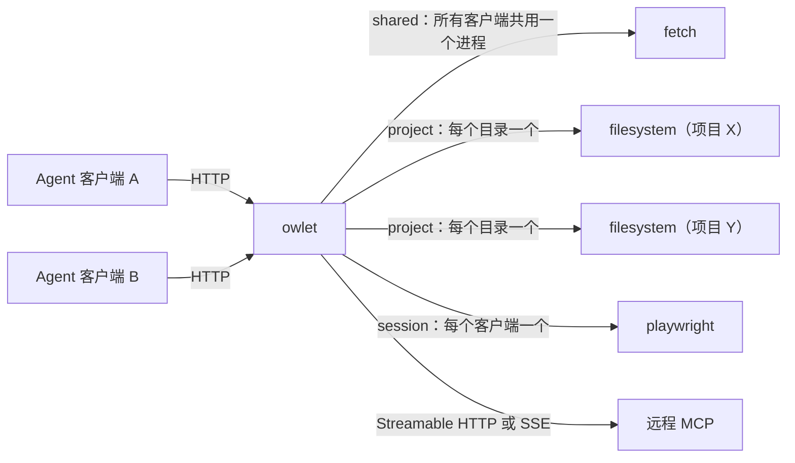

# owlet

[English](README.md)

owlet 让每个 MCP server 只运行一份，再通过 HTTP 共享给所有 agent 客户端。

## 解决什么问题

MCP server 通常是每个客户端各配一份，而且大多是本地的 stdio 进程。一旦同时用多个 agent，就会变得浪费又繁琐：

- **进程重复。** 每个客户端（OpenCode、Claude Code、Cursor 等）都会为自己配置的每个 stdio server 单独启动一个进程。3 个 agent、每个挂 5 个 server，就是 15 个 Node/Python 进程，其中大部分做的是同一件事。
- **用不到也在运行。** 客户端启动时就把所有 server 拉起来，直到退出才结束，不管你有没有调用它们。
- **配置分散在各个客户端里。** 每个 server 的命令、参数、环境变量要在每个客户端的配置里重复写一遍，还得手动保持一致。
- **传输协议不一致。** 有的 server 是远程的，有的用旧版 HTTP+SSE，而各个客户端支持的协议又不一样。

## owlet 怎么解决

owlet 用一个很小的 Rust 进程替代这一切。所有 server 只在一份配置文件里定义一次，各个客户端只需要指向一个 URL。它会：

- server 第一次被调用时才启动，空闲一段时间后自动停止；
- 多个客户端共用同一个进程；对有状态的 server，可以改为每个项目或每个 session 一个进程；
- `initialize` 和 `tools/list` 的结果会缓存，客户端连接时不会把进程拉起来；
- 上游可以是 stdio server、远程 Streamable HTTP server，或旧版 HTTP+SSE server；客户端这边始终只收到 Streamable HTTP 的纯 JSON 响应；
- 可以通过 CLI 在运行时启用或停用某个 server，也可以用桌面应用来管理；
- 用 `owlet update` 自我更新。

## 安装

### CLI

从 [Releases](https://github.com/dennis0700/owlet/releases) 下载对应平台的压缩包。Linux 版本是静态链接的（musl），任何发行版都能直接运行。

| 平台 | 压缩包 |
|---|---|
| Linux x86_64 | `owlet-<version>-x86_64-unknown-linux-musl.tar.gz` |
| Linux arm64 | `owlet-<version>-aarch64-unknown-linux-musl.tar.gz` |
| macOS Apple Silicon | `owlet-<version>-aarch64-apple-darwin.tar.gz` |

macOS Intel 和 Windows 没有预编译的二进制，请从源码构建。

```bash
VERSION=$(curl -fsSLI -o /dev/null -w "%{url_effective}" https://github.com/dennis0700/owlet/releases/latest | sed "s|.*/||")   # 最新 release 的 tag
TARGET=aarch64-apple-darwin
curl -LO "https://github.com/dennis0700/owlet/releases/download/${VERSION}/owlet-${VERSION}-${TARGET}.tar.gz"
curl -LO "https://github.com/dennis0700/owlet/releases/download/${VERSION}/owlet-${VERSION}-${TARGET}.tar.gz.sha256"
shasum -a 256 -c "owlet-${VERSION}-${TARGET}.tar.gz.sha256"
tar -xzf "owlet-${VERSION}-${TARGET}.tar.gz"
install -m 755 "owlet-${VERSION}-${TARGET}/owlet" ~/.local/bin/owlet
```

在 macOS 上，用浏览器下载的二进制可能被系统加上隔离标记，用 `xattr -d com.apple.quarantine ~/.local/bin/owlet` 去掉即可。用 `curl` 下载的不受影响。

从源码构建（需要 Rust 1.89 或更新版本）：

```bash
cargo install --locked --git https://github.com/dennis0700/owlet
```

在 Linux 上作为后台服务运行，见 [docs/systemd.zh-CN.md](docs/systemd.zh-CN.md)。用 Docker 运行，见 [docs/docker.zh-CN.md](docs/docker.zh-CN.md)。

### 桌面应用（macOS）

从 Releases 下载 `owlet-ui-<version>-aarch64-apple-darwin.dmg`（仅支持 Apple Silicon），把 `owlet.app` 拖进“应用程序”。应用内部自带 owlet，不需要另外安装 CLI。功能见[桌面 UI](#桌面-ui)。

应用使用 ad-hoc 签名，没有经过 Apple 公证，所以首次打开时 macOS 可能提示无法验证开发者。右键点击应用选择**打开**，或在“系统设置 → 隐私与安全性”里允许即可。如果仍然打不开，用 `xattr -cr /Applications/owlet.app` 去掉隔离标记。

其他平台请从源码构建 UI（见[桌面 UI](#桌面-ui)）。

## 更新

- CLI：运行 `owlet update`。它从 GitHub Releases 下载适合当前平台的压缩包，校验 sha256 后原子替换正在运行的可执行文件。加 `--check` 只检查是否有新版本，不安装。更新后需要手动重启正在运行的 owlet。可执行文件所在目录不可写时（例如装在 `/usr/local/bin`），请用 `sudo` 运行。
- 桌面应用：启动时自动检查一次。点 **Check for updates**（发现新版本后按钮变成 **Update to x.y.z**），应用会下载、校验签名、安装并自动重启。

## 快速开始

1. 创建 `~/.config/owlet/config.toml`：

   ```toml
   listen = "127.0.0.1:8808"
   token = "换成一个足够长的随机字符串"

   [servers.fetch]
   command = "uvx"
   args = ["mcp-server-fetch"]
   ```

2. 启动 owlet：

   ```bash
   owlet
   ```

3. 把客户端指向聚合端点——它会把所有已启用 server 的工具汇总到一处，客户端自己就能发现这些工具。OpenCode（`opencode.json`）：

   ```json
   {
     "mcp": {
       "owlet": {
         "type": "remote",
         "url": "http://127.0.0.1:8808/mcp",
         "headers": { "Authorization": "Bearer 换成一个足够长的随机字符串" }
       }
     }
   }
   ```

   Claude Code：

   ```bash
   claude mcp add --transport http owlet http://127.0.0.1:8808/mcp \
     --header "Authorization: Bearer 换成一个足够长的随机字符串"
   ```

   其他支持 Streamable HTTP transport 的客户端，配置方式类似。工具名称的命名规则和使用限制见[聚合端点](#聚合端点)。

   想为每个 server 单独配一个 URL？指向 `http://127.0.0.1:8808/mcp/<name>`，例如 `http://127.0.0.1:8808/mcp/fetch`。

4. 查看运行状态：

   ```bash
   owlet status
   ```

## 聚合端点

上面用到的聚合端点会列出所有已启用 server 的工具，名称统一改成 `<server>__<tool>`（例如 `fetch__fetch`），避免重名。`tools/call` 时去掉前缀，路由回对应的 server，和直接访问 `/mcp/<name>` 一样是首次调用才启动进程。

注意事项：

- 只支持 `tools/list` 和 `tools/call`；`prompts/*` 和 `resources/*` 不会在这里暴露。
- 大多数客户端只在 `initialize` 时拉一次工具列表。新增或启用 server 后，要重新连接客户端才能看到新工具。
- `scope = "project"` 的 server 只有在 URL 带上项目路径时才会出现，例如 `http://127.0.0.1:8808/mcp?project=/Users/me/work/my-repo`。不带的话，这些 server 不会出现在列表里。
- 每个上游 server 依然是按需启动、空闲后停止，和直接访问 `/mcp/<name>` 一致。

## 配置

默认配置文件是 `~/.config/owlet/config.toml`，也可以用 `-c <path>` 指定其他路径。完整示例见 [config.example.toml](config.example.toml)。

### 全局配置

| 配置项 | 默认值 | 说明 |
|---|---|---|
| `listen` | `"127.0.0.1:8808"` | 监听地址。 |
| `token` | 无 | 每个请求都要带的 Bearer token。未设置时读取 `$OWLET_TOKEN`。监听非 loopback 地址时，如果没有 token，owlet 会拒绝启动。 |
| `idle_timeout` | `600` | server 空闲多少秒后被停止。 |
| `session_ttl` | `86400` | 客户端 session 空闲多少秒后被清理。 |
| `request_timeout` | `300` | 等待单个上游响应的秒数。 |

### server 配置：`[servers.<name>]`

`<name>` 就是 URL 路径 `/mcp/<name>`。每个 server 必须二选一：`command`（本地 stdio 进程）或 `url`（远程 server）。

| 配置项 | 适用于 | 默认值 | 说明 |
|---|---|---|---|
| `enabled` | 全部 | `true` | 设为 `false` 时配置保留，但不对外提供服务。 |
| `command` | stdio | | 要运行的可执行文件。 |
| `args` | stdio | `[]` | 启动参数。`scope = "project"` 时，`{project}` 会被替换成项目路径。 |
| `env` | stdio | `{}` | 额外的环境变量。 |
| `cwd` | stdio | owlet 的 cwd | 工作目录（`scope = "project"` 时不生效）。 |
| `url` | 远程 | | server 地址。`transport = "sse"` 时填 SSE 流的地址。 |
| `transport` | 远程 | `"http"` | `"http"` 表示 Streamable HTTP，`"sse"` 表示旧版 2024-11-05 HTTP+SSE。 |
| `headers` | 远程 | `{}` | 发给上游的 HTTP header，例如 `Authorization`。 |
| `scope` | 全部 | `"shared"` | 客户端之间如何共享 server（见下文）。 |
| `idle_timeout` | 全部 | 全局值 | 单独为这个 server 覆盖全局值。 |
| `cache_lists` | 全部 | `true` | 缓存 `tools/list`、`prompts/list`、`resources/list` 和 `resources/templates/list` 的结果。 |

### 如何选择 scope

| scope | 实例数 | 适用场景 |
|---|---|---|
| `shared` | 所有客户端共用一个 | 无状态的 server，例如网页抓取、搜索、文档查询。 |
| `project` | 每个项目目录一个，进程以该目录作为 cwd 启动 | 会读取当前项目的 server，例如 filesystem、git、代码索引。仅限 stdio。 |
| `session` | 每个客户端 session 一个，客户端断开时停止 | 有强会话状态的 server，例如浏览器、数据库事务。 |

`scope = "project"` 时，需要在 URL 里带上项目路径：

```
http://127.0.0.1:8808/mcp/git?project=/Users/me/work/my-repo
```

路径必须是已存在的绝对路径。客户端不会自动带上这个参数，所以每个项目要单独配一个 URL。

```toml
[servers.git]
command = "uvx"
args = ["mcp-server-git", "--repository", "{project}"]
scope = "project"
```

### 远程 server

```toml
# Streamable HTTP（当前的 MCP 标准）
[servers.remote]
url = "https://mcp.example.com/mcp"
headers = { Authorization = "Bearer upstream-token" }

# 旧版 HTTP+SSE
[servers.old-remote]
url = "http://127.0.0.1:9000/sse"
transport = "sse"
```

远程 server 也支持多实例，但不能用 `project` scope，因为没有本地进程可以设置 cwd。owlet 收不到远程 server 的 `list_changed` 通知，如果远程的工具列表经常变化，建议设置 `cache_lists = false`。

## CLI

```
owlet [-c <config>] [serve]                       启动服务（默认）
owlet [-c <config>] status [--json]               查看 server 和运行中的实例
owlet [-c <config>] enable  <name>... [--persist] 在运行中的 owlet 上启用 server
owlet [-c <config>] disable <name>... [--persist] 在运行中的 owlet 上停用 server
owlet update [--check]                            更新到 GitHub 上的最新版本
```

`status`、`enable`、`disable` 会从同一份配置文件读取 `listen` 和 `token`，然后连到正在运行的 owlet。

```
$ owlet status
NAME        STATE     TRANSPORT  SCOPE    INSTANCES
fetch       enabled   stdio      shared   1/1 running (pid 4242)
git         enabled   stdio      project  2/3 running (pid 4250,4261)
playwright  disabled  stdio      session  -
sessions: 4
```

- `disable` 会立即停止这个 server 的所有进程或连接，并清掉它的 session。重新启用之前，客户端会收到 `503`。
- `enable` 让 server 重新可用，进程在下一次请求时才启动。
- 不加 `--persist` 时，改动只在 owlet 重启前有效。加了 `--persist`，owlet 会同时把 `enabled = false` 写进配置文件（启用时则删掉这一行），注释和格式都会保留。

`owlet update` 的说明见[更新](#更新)。

## 桌面 UI

`ui/` 是一个 Tauri 2 应用（React + TypeScript），用来管理配置文件里的 `[servers]`，并在托盘里运行 owlet。macOS 上可以直接用 `.dmg` 安装（见[安装](#桌面应用macos)）。它是独立的 Cargo workspace，所以在仓库根目录执行 `cargo build` 不需要 Tauri 工具链。

自行构建：

```sh
cd ui
npm install
npm run tauri dev      # 或：npm run tauri build
```

- 编辑的是 `$OWLET_CONFIG` 指向的文件，未设置时为 `~/.config/owlet/config.toml`，路径会显示在窗口里。
- 开关、新增、编辑、删除都只修改内存里的草稿，按 **Save** 才会写入文件；**Discard** 会丢弃草稿。
- 保存时只改写 `[servers]`，注释、其他配置项和没改动的条目都会保留。
- 关闭窗口会隐藏到托盘（macOS 是菜单栏），草稿保留。点托盘图标或 Dock 图标可以重新显示；用托盘菜单的 **Quit** 退出，退出时未保存的草稿会丢失。
- 应用会在配置的 `listen` 地址上启动自己的 owlet，并显示状态（**Start**、**Stop**、**Restart**）。保存后点 **Restart** 让改动生效。它不会控制另外运行的 `owlet` 进程；如果已有一个在运行，请先停掉，否则端口会被占用。
- 配置文件解析失败时，UI 会显示错误并禁用编辑，不会覆盖这个文件。

## 安全

owlet 背后的 server 往往能执行命令、读写文件，所以 owlet 的端口要像 shell 一样小心对待。

- 没有特别理由的话，`listen` 保持 `127.0.0.1`。
- 一定要设置 `token`。不设的话，本机任何进程都能调用你的 MCP server，也能启用或停用它们。
- 浏览器发来的请求，如果 `Origin` 不是 localhost，owlet 会拒绝，用来防 DNS rebinding。
- 对远程 server，owlet 只会把你配置的 `headers` 发给配置里的那个 origin。

## 限制

- 客户端只会收到纯 JSON 响应，进度通知和 `list_changed` 推送不会转发。tool 调用本身不受影响。
- server 发给客户端的请求（`sampling`、`elicitation`）会被拒绝。`roots/list` 由 owlet 直接回复：有项目路径就返回项目路径，否则返回空列表。
- session 只保存在内存里。owlet 重启后客户端会收到 `404`，然后重新 initialize，MCP 客户端会自动完成这一步。
- 暂不支持 Windows。

## 日志

owlet 把日志输出到 stderr，用 `RUST_LOG` 控制级别，例如 `RUST_LOG=owlet=debug owlet`。在 debug 级别下，日志里还会包含每个 stdio server 的 stderr 输出。

## 实现原理



详细说明见 [docs/architecture.zh-CN.md](docs/architecture.zh-CN.md)。
