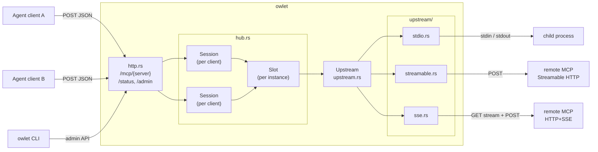
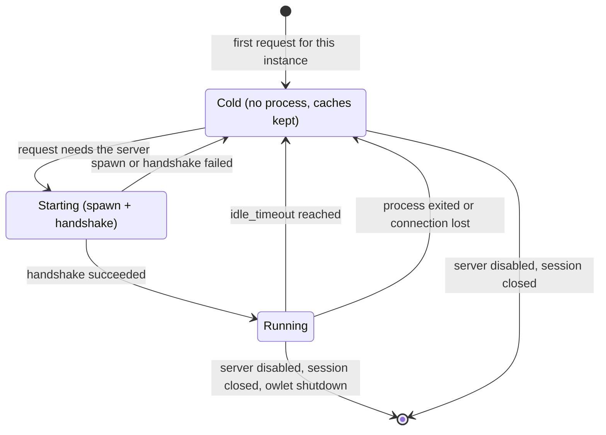
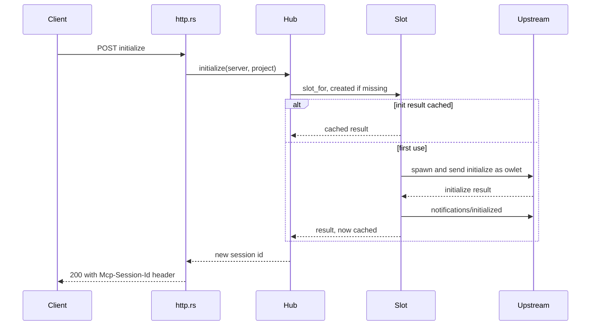
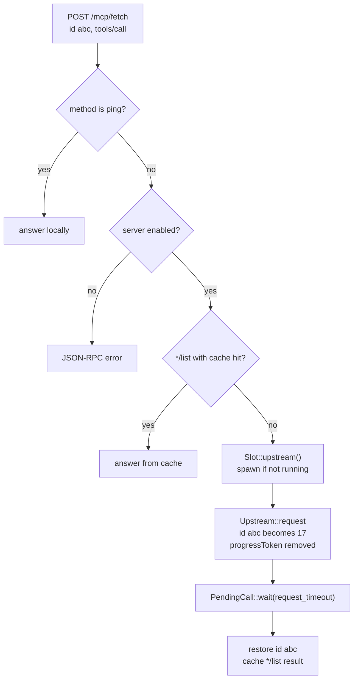
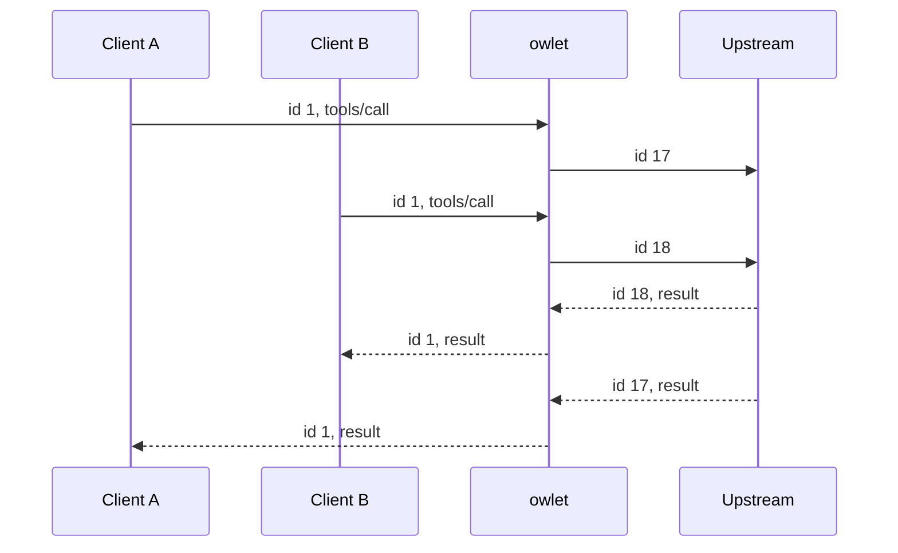
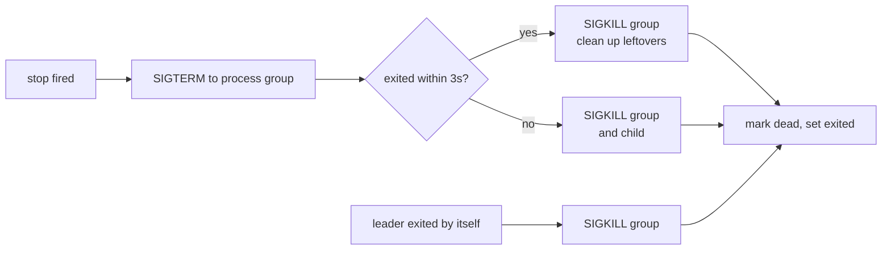
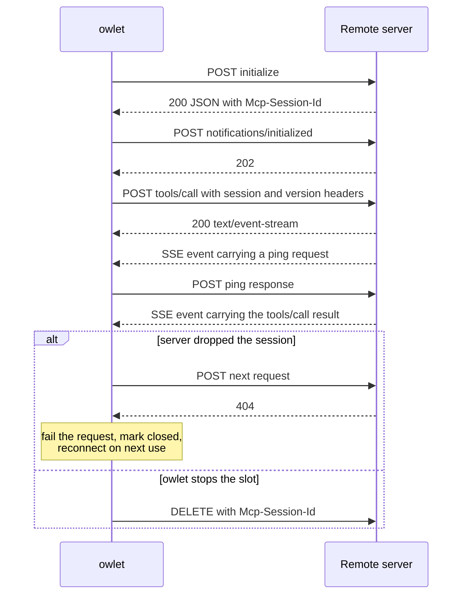
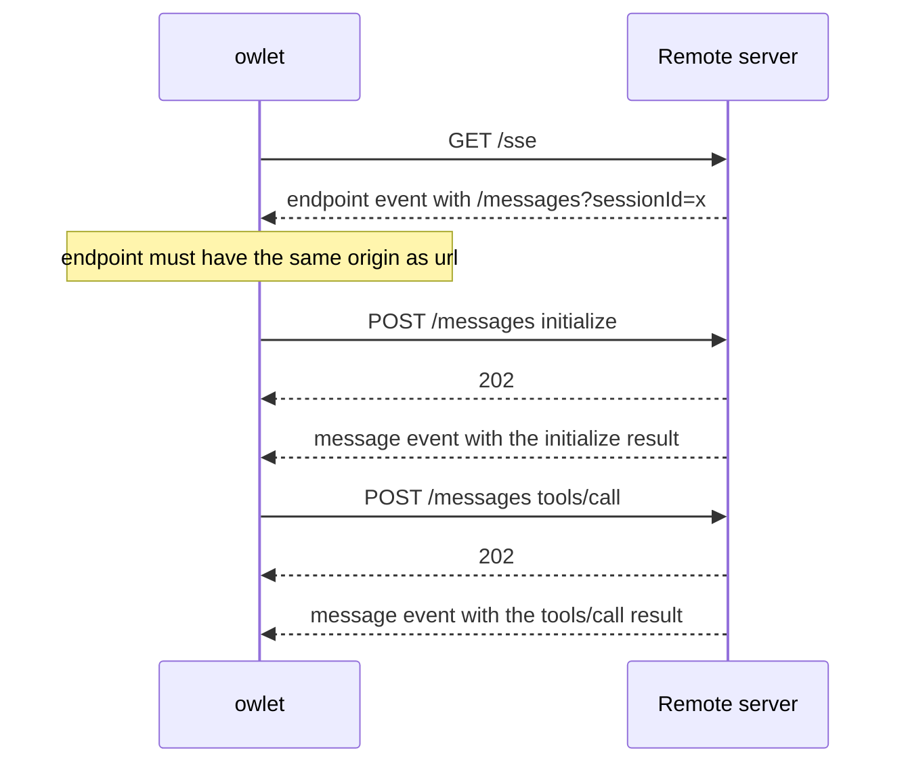
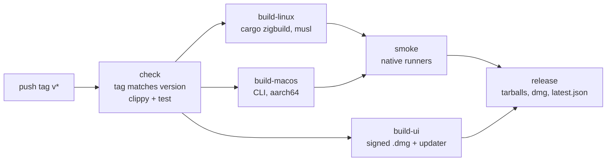

# owlet architecture

[中文](architecture.zh-CN.md)

This document describes how owlet works internally. For usage, see the [README](../README.md).

## Overview

| Module | Responsibility |
|---|---|
| `main.rs` | CLI parsing, `serve` startup, reaper task, graceful shutdown. |
| `config.rs` | TOML loading and validation, and `enabled` write-back with `toml_edit`. |
| `http.rs` | Client-facing Streamable HTTP endpoint, `/status`, admin API, auth and Origin checks. |
| `hub.rs` | Server registry, slots (instances), sessions, list cache, idle reaping, enable and disable. |
| `upstream.rs` | Transport-independent JSON-RPC core: id rewriting, pending requests, cancellation, handshake. |
| `upstream/stdio.rs` | Child process transport and process-group lifecycle. |
| `upstream/streamable.rs` | Streamable HTTP client transport. |
| `upstream/sse.rs` | Legacy HTTP+SSE client transport. |
| `upstream/remote.rs` | Helpers shared by both HTTP transports: client setup, SSE parser, local request failure. |
| `admin.rs` | CLI client for `status`, `enable` and `disable`. |
| `jsonrpc.rs` | Message classification and response builders. |

## Core concepts

### Server

A server is one `[servers.<name>]` entry. The hub keeps a `ServerEntry` for each one: the immutable config plus an `AtomicBool` that holds its enabled state at runtime.

### Slot

A slot is one logical instance of a server. Its key is `(server, instance)`, where `instance` depends on the scope:

| Scope | Instance key |
|---|---|
| `shared` | `""` |
| `project` | canonicalized project path |
| `session` | `session:<session id>` |

A slot owns:

- `live`: the running `Upstream`, if any. This is a `tokio::Mutex`, so concurrent first calls produce a single spawn.
- `init`: the cached `initialize` result.
- `lists`: the cached `*/list` results.
- `last_used` and `inflight`: the inputs for idle reaping.

The cached fields outlive the process. After a slot is reaped, a new client can still initialize and list tools without anything being spawned. Only a real call such as `tools/call` starts the process again.

### Session

A session is one client connection, identified by `Mcp-Session-Id`. It points to one slot and records the client's in-flight requests, so that a `notifications/cancelled` from the client can be routed to the matching upstream request. A session owns its slot only when the scope is `session`.

### Upstream

An upstream is one live connection that has completed the MCP handshake. It is either a child process or an HTTP connection.

## Request flow

### Client `initialize`

1. `http.rs` finds an `initialize` request, which must be the only message in the POST.
2. `Hub::initialize` resolves the slot (`slot_for`), checks that the server is enabled, and uses the cached `init` result if there is one. Otherwise it spawns the upstream and caches the result.
3. A new session id is created and returned in the `Mcp-Session-Id` header.

The upstream handshake is owlet's own, done once per process: owlet sends `initialize` with `clientInfo = owlet` and protocol `2025-06-18`, then `notifications/initialized`. The client's `initialize` parameters are never forwarded. Every client gets the cached server result.

### Client request

Batches are forwarded concurrently with `join_all`. Notifications are not forwarded, except for these:

- `notifications/cancelled` is mapped to the upstream id and sent upstream;
- `initialized` and `roots/list_changed` are dropped, because owlet handled the handshake;
- other notifications are passed through, but only if the process is already running. A notification never spawns a process.

### Id rewriting

Every upstream request gets a fresh id from an `AtomicU64` counter. The upstream only ever sees owlet's ids, so ids from different clients cannot collide. `Inner.pending` maps each upstream id to a `oneshot::Sender`. The reader task resolves the sender when the response arrives, and the hub then writes the client's original id back into the response.

### Cancellation

`PendingCall` implements `Drop`. If it is dropped before a response arrives, for example because the client disconnected, the HTTP handler future was dropped, or the timeout fired, it removes its pending entry and sends `notifications/cancelled` upstream. The Streamable HTTP transport also aborts the matching POST task.

### Requests sent by the server

A shared process cannot know which client a server-initiated request is meant for, so owlet answers these requests itself:

| Method | Answer |
|---|---|
| `ping` | `{}` |
| `roots/list` | The slot's root (the project path, or `cwd` if set) as a `file://` URI, otherwise `[]` |
| anything else (`sampling/*`, `elicitation/*`, …) | `-32601 method not found` |

owlet declares the `roots` capability upstream only when the slot has a root.

### Notifications sent by the server

- `notifications/progress` is dropped. Clients never get a stream, so there is nowhere to deliver it, and owlet removes `progressToken` from requests so that servers do not send progress in the first place.
- `notifications/*/list_changed` clears the matching cached lists.
- Everything else is ignored.

## Client-facing protocol

owlet implements Streamable HTTP in JSON-only mode, which the specification allows:

| Method | Behaviour |
|---|---|
| `POST /mcp/{server}` | Always `application/json`. Notifications only → `202`. Missing session → `400`. Unknown session → `404`. Disabled server → `503`. Upstream failure during initialize → `502`. |
| `GET /mcp/{server}` | `405` with `Allow: POST, DELETE`. owlet never opens a server-to-client stream. |
| `DELETE /mcp/{server}` | Ends the session (`204`). A session-scoped process is stopped immediately. |

A session id is valid only for the server it was created on.

## Transports

All transports receive the same `Wiring`:

- `reader`: an `Inner` handle, the notify callback and the root, used to dispatch incoming messages;
- `outgoing`: an `mpsc` receiver of serialized messages to send;
- `stop`: a `oneshot` that fires on shutdown, or when the `Upstream` handle is dropped;
- `exited`: a `watch` that the transport sets once it has fully stopped.

`Upstream::shutdown` fires `stop` and waits on `exited`.

### stdio

- The child is spawned with piped stdin, stdout and stderr, `kill_on_drop`, and on Unix `process_group(0)`. A separate process group matters because `npx` and `uvx` are wrappers. Killing only the wrapper would leave the real server running.
- The writer task writes one JSON object per line to stdin.
- The reader task parses stdout line by line. Lines that are not JSON are logged and skipped.
- The stderr task forwards each line to the `debug` log.
- The wait task handles two cases:
  - On `stop`, it sends `SIGTERM` to the whole group, waits up to 3 seconds, then sends `SIGKILL`.
  - If the leader exits on its own, it sends `SIGKILL` to the group to clean up any orphans.

### Streamable HTTP (`streamable.rs`)

- Each outgoing message becomes its own POST task in a `JoinSet`, so slow calls do not block other calls. Each request carries `Accept: application/json, text/event-stream`.
- The `Mcp-Session-Id` from the `initialize` response is stored. The negotiated `protocolVersion` is stored and sent back as `MCP-Protocol-Version`.
- How responses are handled:
  - `application/json`: a single message or a batch;
  - `text/event-stream`: a stream of `message` events, which may include server requests and notifications before the reply;
  - `202`: no reply expected.
- A `404` while a session exists means the server dropped the session. The request fails immediately and the connection is marked closed. The slot reconnects, with a new handshake, on the next use.
- Any POST that cannot produce a reply resolves the pending request locally with a JSON-RPC error through `remote::fail_request`, so the caller does not wait for `request_timeout`.
- On shutdown, owlet sends a best-effort `DELETE` with the session id, unless the server already returned 404.
- The optional GET notification stream is not opened.

### Legacy HTTP+SSE (`sse.rs`)

- owlet first sends `GET url` with `Accept: text/event-stream`. The first `endpoint` event, which must arrive within 30 seconds, gives the POST URL.
- The endpoint is resolved relative to `url` and must have the same origin. This keeps configured credentials from being sent to another host.
- Outgoing messages are POSTed one at a time, in order. Replies arrive as `message` events on the long-lived GET stream.
- When the stream ends, the connection is marked dead. The slot reconnects on the next use.

### SSE parser

`remote::SseParser` is an incremental parser for `text/event-stream`. It handles chunk boundaries, LF and CRLF, comment lines and multi-line `data:`, and defaults the event name to `message`. Both HTTP transports use it.

## Lifecycle

### Lazy start

Nothing starts when owlet starts. A slot spawns its upstream in `Slot::upstream()` on the first request that actually needs the server. If `init` is not cached yet, the first `initialize` also needs the server.

### Idle reaping

`Hub::reap_loop` runs `reap()` every `clamp(min(idle_timeout) / 2, 1s, 15s)`. Each run:

1. closes sessions not seen for `session_ttl`;
2. for each slot with `inflight == 0` and `last_used` older than its `idle_timeout`, takes the upstream and shuts it down. The reaper uses `try_lock` on `live`, so it skips a slot that is in the middle of spawning.

### Enable and disable

`Hub::set_enabled` flips the flag while holding the slots lock, and `slot_for` checks the flag under the same lock, so no slot can be created for a server after it has been disabled. Disabling removes the server's slots and sessions and stops every upstream. In-flight requests fail, and later requests on old sessions get `404` and then `503` on re-initialize. Enabling only flips the flag.

With `--persist`, the admin handler calls `Config::persist_enabled`, which works as follows:

- parses the file with `toml_edit`, so comments and layout are kept;
- sets `enabled = false`, or removes the key when enabling;
- checks that the result still loads as a valid owlet config;
- writes a temporary file and renames it over the original.

A mutex serializes these edits. If the file write fails after the runtime state has changed, the response reports `persisted: false` together with the error.

## Concurrency

- Shared state uses `parking_lot::Mutex`, which does not poison. No `parking_lot` guard is held across an `.await`.
- `Slot.live` is a `tokio::Mutex` because it is held across the spawn and handshake.
- Messages to an upstream go through an unbounded `mpsc` to one writer task, so writes to a child's stdin never interleave.
- Responses travel through `oneshot` channels in `Inner.pending`. When a transport dies, `mark_dead` clears the map, which drops every sender and wakes all waiters with an error.

## Security

- The `guard` middleware runs on every route, including `/status` and `/admin`:
  - it rejects requests whose `Origin` header is present but whose host is not `localhost`, `127.0.0.1` or `::1` (`403`);
  - if a token is configured, it requires `Authorization: Bearer <token>`, compared in constant time with `subtle` (`401`).
- `Config::load` refuses to start on a non-loopback `listen` address without a token.
- Upstream `headers` are marked sensitive in reqwest, so they are not printed in debug output.
- The SSE `endpoint` must have the same origin as the configured `url`.

## Testing

`cargo test` runs:

- unit tests for config parsing and validation, JSON-RPC classification, Origin rules, the SSE parser, scope and slot mapping, enable and disable, status rendering, and `toml_edit` write-back;
- an id-rewriting and shutdown test against a real `python3` child process;
- in-process axum fake servers for both HTTP transports, covering JSON and SSE replies, server-initiated pings, session headers, `DELETE`, session expiry and reconnect, and failed POSTs.

## Build and release

`.github/workflows/release.yml` runs on `v*` tags:

1. `check`: verifies that the tag matches the version in `Cargo.toml`, `ui/src-tauri/Cargo.toml`, `ui/src-tauri/tauri.conf.json` and `ui/package.json`, then runs clippy (`-D warnings`) and tests on Linux and macOS.
2. `build-linux`: builds `x86_64-unknown-linux-musl` and `aarch64-unknown-linux-musl` with `cargo zigbuild`, using a pinned Zig release checked by sha256, and verifies that the binaries are statically linked. Zig also provides the C toolchain that `aws-lc-rs` (via rustls) needs, so cmake is not required.
3. `build-macos`: builds the CLI for `aarch64-apple-darwin` on `macos-15`.
4. `build-ui`: builds the Tauri desktop app for `aarch64-apple-darwin` on `macos-15`. The bundle is ad-hoc signed, and the updater archive (`.app.tar.gz`) is signed with the minisign key in the `TAURI_SIGNING_PRIVATE_KEY` secret. The matching public key is in `tauri.conf.json`, so losing the private key means installed apps can no longer be updated.
5. `smoke`: runs each packaged CLI binary on a native runner for its architecture (`ubuntu-24.04`, `ubuntu-24.04-arm`, `macos-15`).
6. `release`: writes `latest.json` (the manifest the desktop app polls for updates), then uploads the CLI tarballs, the `.dmg`, the signed updater archive and the `.sha256` files to a GitHub Release. Tags containing `-` are marked as prereleases.

`owlet update` reads the latest release from the GitHub API, downloads the tarball for its own target triple and verifies it against the `.sha256` file before replacing the executable.

Every JavaScript action used runs on Node 24, and `FORCE_JAVASCRIPT_ACTIONS_TO_NODE24` is set as a safeguard.
