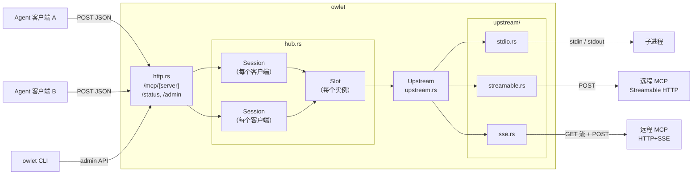
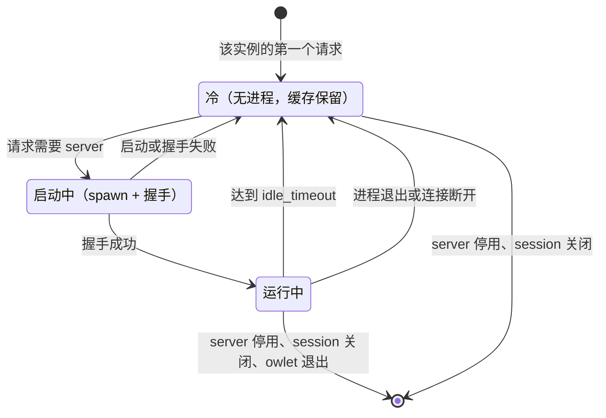
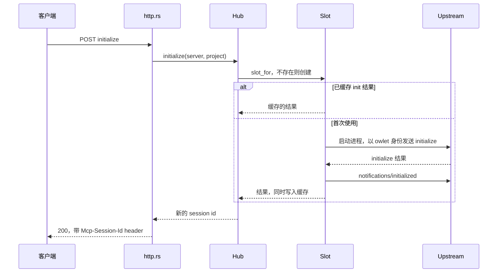
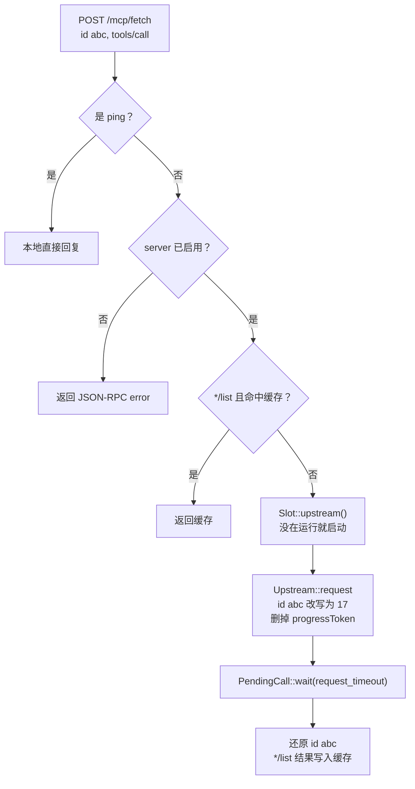
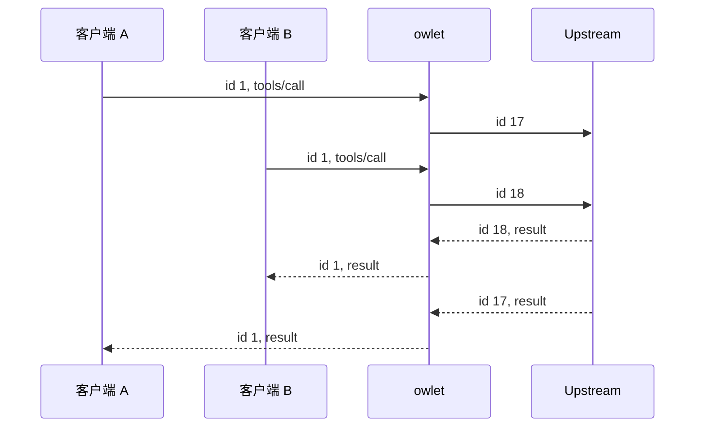
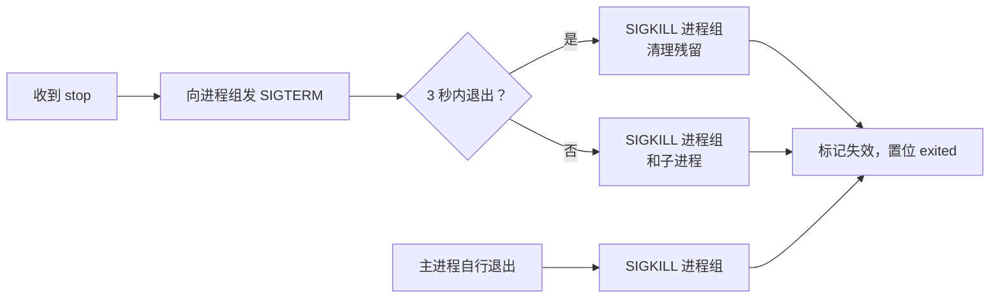
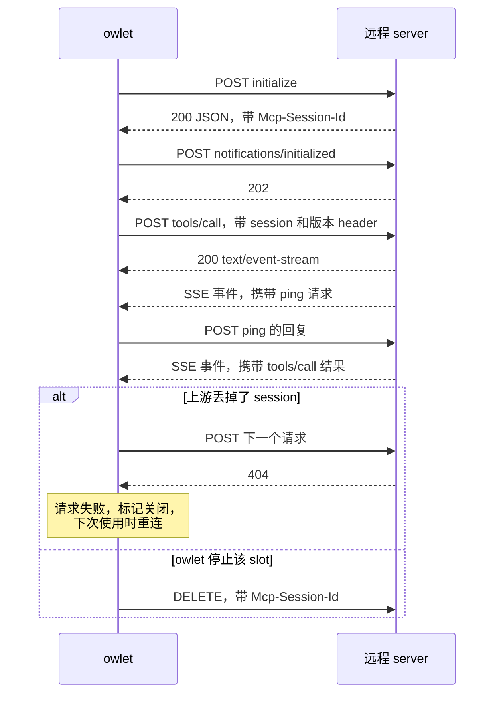
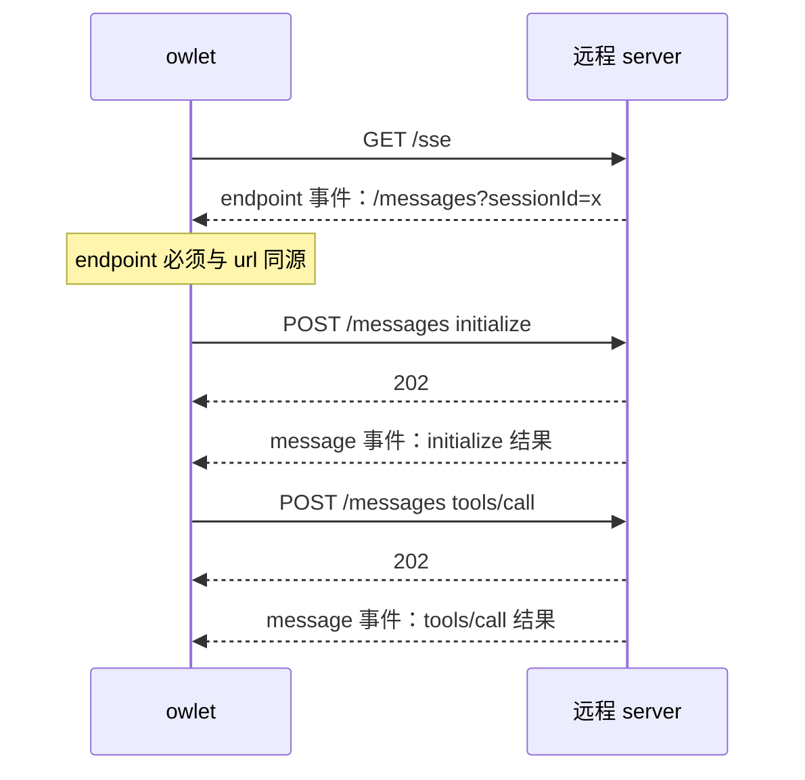
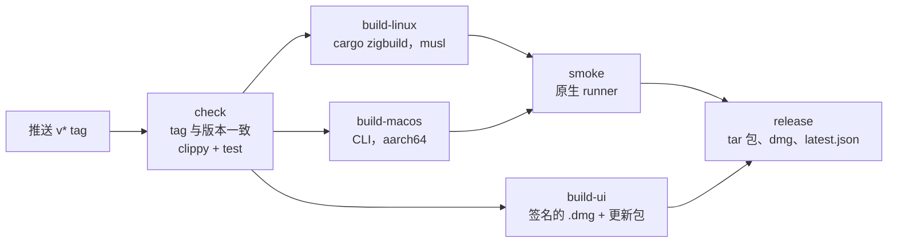

# owlet 实现原理

[English](architecture.md)

本文介绍 owlet 的内部实现。使用方法见 [README](../README.zh-CN.md)。

## 总览

| 模块 | 职责 |
|---|---|
| `main.rs` | CLI 解析、`serve` 启动、回收任务、优雅退出。 |
| `config.rs` | TOML 加载与校验，用 `toml_edit` 回写 `enabled`。 |
| `http.rs` | 面向客户端的 Streamable HTTP 端点、`/status`、admin API、鉴权和 Origin 校验。 |
| `hub.rs` | server 注册表、slot（实例）、session、列表缓存、idle 回收、启用与停用。 |
| `upstream.rs` | 与 transport 无关的 JSON-RPC 核心：id 改写、pending 表、取消、握手。 |
| `upstream/stdio.rs` | 子进程 transport 和进程组的生命周期管理。 |
| `upstream/streamable.rs` | Streamable HTTP client transport。 |
| `upstream/sse.rs` | 旧版 HTTP+SSE client transport。 |
| `upstream/remote.rs` | 两种 HTTP transport 的公共部分：HTTP client 构建、SSE parser、请求失败时的本地兜底。 |
| `admin.rs` | `status`、`enable`、`disable` 子命令使用的 CLI 客户端。 |
| `jsonrpc.rs` | 消息分类和响应构造。 |

## 核心概念

### Server

每个 `[servers.<name>]` 配置项就是一个 server。hub 为它保存一个 `ServerEntry`，包含不可变的配置和一个 `AtomicBool`，后者记录运行时的启用状态。

### Slot

slot 是 server 的一个逻辑实例，key 为 `(server, instance)`，其中 `instance` 由 scope 决定：

| scope | instance |
|---|---|
| `shared` | `""` |
| `project` | 规范化后的项目路径 |
| `session` | `session:<session id>` |

slot 持有：

- `live`：当前运行的 `Upstream`（可能为空）。它是 `tokio::Mutex`，多个请求同时首次调用时只会 spawn 一次；
- `init`：缓存的 `initialize` 结果；
- `lists`：缓存的 `*/list` 结果；
- `last_used` 和 `inflight`：idle 回收的判断依据。

缓存比进程活得久。slot 被回收后，新客户端照样能完成 initialize、拿到工具列表，期间不会启动任何进程。只有真正的调用（例如 `tools/call`）才会重新拉起进程。

### Session

session 对应一个客户端连接，用 `Mcp-Session-Id` 标识。它指向一个 slot，并记录该客户端正在执行的请求，这样客户端发来 `notifications/cancelled` 时能找到对应的上游请求。只有 scope 为 `session` 时，session 才独占它的 slot。

### Upstream

upstream 是一条已经完成 MCP 握手的连接，可能是子进程，也可能是 HTTP 连接。

## 请求流程

### 客户端 `initialize`

1. `http.rs` 识别出 `initialize`，它必须是这个 POST 里唯一的消息。
2. `Hub::initialize` 通过 `slot_for` 找到 slot，检查 server 是否启用。有缓存的 `init` 就直接使用，没有就启动 upstream 并把结果缓存起来。
3. 生成新的 session id，通过 `Mcp-Session-Id` header 返回。

与上游的握手由 owlet 自己完成，每个进程只做一次：owlet 以 `clientInfo = owlet`、协议版本 `2025-06-18` 发送 `initialize`，然后发送 `notifications/initialized`。客户端 `initialize` 的参数不会转发给上游，所有客户端拿到的都是同一份缓存结果。

### 客户端请求

batch 请求用 `join_all` 并发转发。通知一般不转发，以下几种例外：

- `notifications/cancelled`：映射成上游 id 后发给上游；
- `initialized` 和 `roots/list_changed`：直接丢弃，因为握手由 owlet 完成；
- 其他通知：只在进程已经运行时才透传，通知永远不会拉起进程。

### id 改写

每个发往上游的请求都从一个 `AtomicU64` 计数器取新 id，上游只会看到 owlet 分配的 id，所以不同客户端的 id 不会冲突。`Inner.pending` 记录上游 id 到 `oneshot::Sender` 的映射。reader 任务收到响应后通过它把响应交给等待方，hub 再把客户端原来的 id 写回响应。

### 取消

`PendingCall` 实现了 `Drop`。如果在收到响应之前被 drop，比如客户端断开导致 HTTP handler 的 future 被丢弃，或者超时，它会删除自己在 pending 表里的条目，并向上游发送 `notifications/cancelled`。Streamable HTTP transport 还会同时中止对应的 POST 任务。

### server 发来的请求

进程被共享时，无法判断 server 发起的请求该交给哪个客户端，所以这类请求由 owlet 自己回复：

| method | 回复 |
|---|---|
| `ping` | `{}` |
| `roots/list` | slot 有 root（项目路径，或配置了 `cwd`）时返回对应的 `file://` URI，否则返回 `[]` |
| 其他（`sampling/*`、`elicitation/*` 等） | `-32601 method not found` |

只有 slot 有 root 时，owlet 才会向上游声明 `roots` capability。

### server 发来的通知

- `notifications/progress`：丢弃。客户端拿不到流，进度通知没有地方可送。owlet 发请求时也会删掉 `progressToken`，server 一般就不会发进度通知。
- `notifications/*/list_changed`：清掉对应的列表缓存。
- 其他通知：忽略。

## 面向客户端的协议

owlet 实现的是 Streamable HTTP 的纯 JSON 模式，这是协议规范允许的：

| 方法 | 行为 |
|---|---|
| `POST /mcp/{server}` | 响应始终是 `application/json`。只包含通知时返回 `202`；缺少 session 返回 `400`；session 不存在返回 `404`；server 已停用返回 `503`；initialize 时上游出错返回 `502`。 |
| `GET /mcp/{server}` | 返回 `405`，并带 `Allow: POST, DELETE`。owlet 不提供 server 到 client 的推送流。 |
| `DELETE /mcp/{server}` | 结束 session，返回 `204`。如果是 session scope 的进程，立即停止。 |

session id 只在创建它的那个 server 下有效。

## Transport

所有 transport 拿到的都是同一种 `Wiring`：

- `reader`：`Inner` 句柄、通知回调和 root，用来分发收到的消息；
- `outgoing`：`mpsc` 接收端，里面是要发出去的已序列化消息；
- `stop`：一个 `oneshot`，在 shutdown 或 `Upstream` 句柄被 drop 时触发；
- `exited`：一个 `watch`，transport 完全停止后由它置位。

`Upstream::shutdown` 触发 `stop`，然后等待 `exited`。

### stdio

- 子进程启动时 stdin、stdout、stderr 都设为 pipe，开启 `kill_on_drop`，Unix 上还设置 `process_group(0)`。单独建进程组是因为 `npx`、`uvx` 只是包装器，只杀掉包装器的话，真正的 server 会留下来。
- writer 任务：往 stdin 每行写一个 JSON 对象。
- reader 任务：逐行解析 stdout，不是 JSON 的行记日志后跳过。
- stderr 任务：每一行转到 `debug` 日志。
- wait 任务分两种情况：
  - 收到 `stop`：向整个进程组发 `SIGTERM`，最多等 3 秒，还没退出就发 `SIGKILL`；
  - 主进程自己退出：向进程组发 `SIGKILL`，清理残留的子进程。

### Streamable HTTP（`streamable.rs`）

- 每条待发消息都是 `JoinSet` 里一个独立的 POST 任务，慢请求不会挡住其他请求。每个请求都带 `Accept: application/json, text/event-stream`。
- 保存 `initialize` 响应里的 `Mcp-Session-Id`，以及协商出的 `protocolVersion`，后者作为 `MCP-Protocol-Version` header 随后续请求发送。
- 响应处理方式：
  - `application/json`：单条消息或 batch；
  - `text/event-stream`：读取一串 `message` 事件，最终回复之前可能夹带 server 发起的请求和通知；
  - `202`：不需要等回复。
- 已有 session 时收到 `404`，说明上游丢掉了 session：当前请求立即失败，连接标记为关闭，slot 在下次使用时重新连接并握手。
- POST 拿不到回复时，通过 `remote::fail_request` 在本地返回 JSON-RPC error，调用方不用等到 `request_timeout`。
- 关闭时尽力发一次带 session id 的 `DELETE`。如果上游之前已经返回过 404，就不再发。
- 没有打开可选的 GET 通知流。

### 旧版 HTTP+SSE（`sse.rs`）

- 先发 `GET url`，带 `Accept: text/event-stream`。第一个 `endpoint` 事件必须在 30 秒内到达，它给出后续 POST 的地址。
- endpoint 相对 `url` 解析，并且必须同源，这样配置的认证信息不会被发到其他主机。
- 待发消息逐条按顺序 POST，回复从长连接 GET 流里的 `message` 事件读出来。
- 流结束后连接标记为失效，slot 在下次使用时重连。

### SSE parser

`remote::SseParser` 是一个增量式的 `text/event-stream` 解析器，能处理跨 chunk 的数据、LF 和 CRLF、注释行以及多行 `data:`，事件名缺省为 `message`。两种 HTTP transport 共用它。

## 生命周期

### 懒启动

owlet 启动时什么都不会拉起。slot 在第一个真正需要 server 的请求到来时，才在 `Slot::upstream()` 里启动 upstream。如果 `init` 还没有缓存，第一次 `initialize` 也算需要 server。

### idle 回收

`Hub::reap_loop` 每隔 `clamp(min(idle_timeout) / 2, 1s, 15s)` 执行一次 `reap()`，每次做两件事：

1. 关闭超过 `session_ttl` 没有活动的 session；
2. 遍历 slot，`inflight == 0` 且 `last_used` 超过各自 `idle_timeout` 的，取出 upstream 并关闭。回收时对 `live` 用 `try_lock`，正在启动的 slot 会被跳过。

### 启用与停用

`Hub::set_enabled` 在持有 slots 锁的情况下修改启用标志，`slot_for` 也在同一把锁下检查这个标志，所以 server 被停用之后不会再有新 slot 创建出来。停用会删除这个 server 的所有 slot 和 session，并停止所有 upstream：正在执行的请求会失败，旧 session 再发请求会收到 `404`，重新 initialize 会收到 `503`。启用只修改标志，不做其他事。

带 `--persist` 时，admin handler 调用 `Config::persist_enabled`，流程如下：

- 用 `toml_edit` 解析配置文件，保留注释和排版；
- 停用时写入 `enabled = false`，启用时删掉这个 key；
- 检查修改后的配置仍能被 owlet 正常加载；
- 先写临时文件，再 rename 覆盖原文件。

这些修改由一个 mutex 串行执行。如果运行时状态已经改了、但写文件失败，响应里会返回 `persisted: false` 和错误信息。

## 并发

- 共享状态用 `parking_lot::Mutex`，不会 poison。持有 `parking_lot` 锁时不会 `.await`。
- `Slot.live` 用的是 `tokio::Mutex`，因为启动进程和握手期间都要持有它。
- 发往上游的消息经过一个无界 `mpsc`，由唯一的 writer 任务写出，所以写入子进程 stdin 的内容不会交错。
- 响应通过 `Inner.pending` 里的 `oneshot` 传递。transport 挂掉时，`mark_dead` 清空这张表，所有 sender 被 drop，等待方都会收到错误并被唤醒。

## 安全

- `guard` 中间件作用于所有路由，包括 `/status` 和 `/admin`：
  - 请求带了 `Origin` header 但 host 不是 `localhost`、`127.0.0.1` 或 `::1` 时，拒绝并返回 `403`；
  - 配置了 token 时，要求 `Authorization: Bearer <token>`，用 `subtle` 做常量时间比较，不匹配返回 `401`。
- `listen` 不是 loopback 地址又没配 token 时，`Config::load` 拒绝启动。
- 上游 `headers` 在 reqwest 里标记为 sensitive，不会出现在 debug 输出中。
- SSE 的 `endpoint` 必须与配置的 `url` 同源。

## 测试

`cargo test` 包含：

- 单元测试：配置解析与校验、JSON-RPC 分类、Origin 规则、SSE parser、scope 到 slot 的映射、启用与停用、status 渲染、`toml_edit` 回写；
- 用真实 `python3` 子进程验证 id 改写和关闭流程；
- 用进程内的 axum 假 server 测试两种 HTTP transport，覆盖 JSON 和 SSE 响应、server 发起的 ping、session header、`DELETE`、session 过期后重连，以及 POST 失败。

## 构建与发布

`.github/workflows/release.yml` 在推送 `v*` tag 时触发：

1. `check`：确认 tag 与 `Cargo.toml`、`ui/src-tauri/Cargo.toml`、`ui/src-tauri/tauri.conf.json`、`ui/package.json` 里的版本一致，然后在 Linux 和 macOS 上运行 clippy（`-D warnings`）和测试。
2. `build-linux`：用 `cargo zigbuild` 构建 `x86_64-unknown-linux-musl` 和 `aarch64-unknown-linux-musl`。Zig 的版本固定，下载后校验 sha256。构建完检查产物是否为静态链接。Zig 同时提供 `aws-lc-rs`（经由 rustls 引入）所需的 C 工具链，所以不需要 cmake。
3. `build-macos`：在 `macos-15` 上构建 `aarch64-apple-darwin` 的 CLI。
4. `build-ui`：在 `macos-15` 上构建 `aarch64-apple-darwin` 的 Tauri 桌面应用。应用包做 ad-hoc 签名，更新包（`.app.tar.gz`）用 secret `TAURI_SIGNING_PRIVATE_KEY` 里的 minisign 私钥签名。对应的公钥写在 `tauri.conf.json` 里，所以私钥丢失后，已安装的应用就无法再更新。
5. `smoke`：在各架构对应的原生 runner（`ubuntu-24.04`、`ubuntu-24.04-arm`、`macos-15`）上运行打包好的 CLI 二进制。
6. `release`：生成 `latest.json`（桌面应用检查更新时读取的清单），然后把 CLI 的 tar 包、`.dmg`、签名的更新包和 `.sha256` 文件上传到 GitHub Release，tag 中带 `-` 的标记为 prerelease。

`owlet update` 通过 GitHub API 读取最新的 release，下载与自己 target triple 对应的 tar 包，用 `.sha256` 文件校验通过后才替换可执行文件。

用到的 JavaScript action 都运行在 Node 24 上，另外设置了 `FORCE_JAVASCRIPT_ACTIONS_TO_NODE24` 作为兜底。
